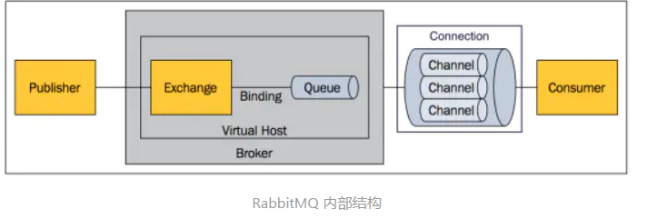
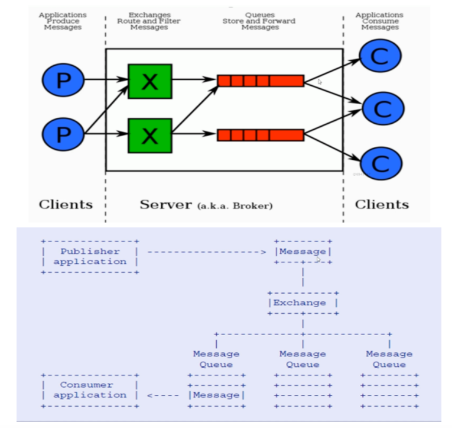

## RabbitMQ

#### 什么叫消息队列?

消息是指在应用间传送的数据,消息可以非常简单,比如只包含字符串字符串,也可以更复杂,可能包含嵌入对象。

消息队列是一种在应用间的通信方式，消息发送后可以立即返回，由消息系统来确保消息的可靠传递，消息发布者只管把消息发布到MQ中而不用管谁来取，消息使用者只管从MQ中取消息而不管是谁发布的。这样发布者和使用者都不用知道对方的存在。

#### 为何用消息队列？
 从上面的描述看可以看出消息队列是一种应用间的异步协作机制，那什么时候需要使用MQ呢？
 以常见的订单系统为例，用户点击【下单】按钮之后的业务逻辑可能包括：扣减库存、生成相应单据、发红包、发短信通知。在业务发展初期这些逻辑可能放在一起同步执行，随着业务的发展订单量增长，需要提升系统服务的性能，这时可以将一些不需要立即生效的操作拆分出来异步执行，比如发放红包、发短信通知等。这种场景下就可以用 MQ ，在下单的主流程（比如扣减库存、生成相应单据）完成之后发送一条消息到 MQ 让主流程快速完结，而由另外的单独线程拉取MQ的消息（或者由 MQ 推送消息），当发现 MQ 中有发红包或发短信之类的消息时，执行相应的业务逻辑。

 以上是用于业务解耦的情况，其它常见场景包括最终一致性、广播、错峰流控等等。
#### RabbitMQ 特点
1. RabbitMQ 是一个由 Erlang 语言开发的 AMQP 的开源实现。

2. AMQP ：Advanced Message Queue，高级消息队列协议。它是应用层协议的一个开放标准，为面向消息的中间件设计，基于此协议的客户端与消息中间件可传递消息，并不受产品、开发语言等条件的限制。

3. RabbitMQ 最初起源于金融系统，用于在分布式系统中存储转发消息，在易用性、扩展性、高可用性等方面表现不俗。具体特点包括：

4. 可靠性（Reliability）
   RabbitMQ 使用一些机制来保证可靠性，如持久化、传输确认、发布确认。

5. 灵活的路由（Flexible Routing）
   在消息进入队列之前，通过 Exchange 来路由消息的。对于典型的路由功能，RabbitMQ 已经提供了一些内置的 Exchange 来实现。针对更复杂的路由功能，可以将多个 Exchange 绑定在一起，也通过插件机制实现自己的 Exchange 。

6. 消息集群（Clustering）
   多个 RabbitMQ 服务器可以组成一个集群，形成一个逻辑 Broker 。

7. 高可用（Highly Available Queues）
   队列可以在集群中的机器上进行镜像，使得在部分节点出问题的情况下队列仍然可用。

8. 多种协议（Multi-protocol）
   RabbitMQ 支持多种消息队列协议，比如 STOMP、MQTT 等等。

9. 多语言客户端（Many Clients）
   RabbitMQ 几乎支持所有常用语言，比如 Java、.NET、Ruby 等等。

10. 管理界面（Management UI）
    RabbitMQ 提供了一个易用的用户界面，使得用户可以监控和管理消息 Broker 的许多方面。

11. 跟踪机制（Tracing）
    如果消息异常，RabbitMQ 提供了消息跟踪机制，使用者可以找出发生了什么。

12. 插件机制（Plugin System）
    RabbitMQ 提供了许多插件，来从多方面进行扩展，也可以编写自己的插件。
    
    ##### RabbitMQ 基本概念
    
    上面只是最简单抽象的描述，具体到 RabbitMQ 则有更详细的概念需要解释。上面介绍过 RabbitMQ 是 AMQP 协议的一个开源实现，所以其内部实际上也是 AMQP 中的基本概念：

- Message
   消息，消息是不具名的，它由消息头和消息体组成。消息体是不透明的，而消息头则由一系列的可选属性组成，这些属性包括routing-key（路由键）、priority（相对于其他消息的优先权）、delivery-mode（指出该消息可能需要持久性存储）等。
- Publisher
   消息的生产者，也是一个向交换器发布消息的客户端应用程序。
- Exchange
   交换器，用来接收生产者发送的消息并将这些消息路由给服务器中的队列。
- Binding
   绑定，用于消息队列和交换器之间的关联。一个绑定就是基于路由键将交换器和消息队列连接起来的路由规则，所以可以将交换器理解成一个由绑定构成的路由表。
- Queue
   消息队列，用来保存消息直到发送给消费者。它是消息的容器，也是消息的终点。一个消息可投入一个或多个队列。消息一直在队列里面，等待消费者连接到这个队列将其取走。
- Connection
   网络连接，比如一个TCP连接。

- Channel
   信道，多路复用连接中的一条独立的双向数据流通道。信道是建立在真实的TCP连接内地虚拟连接，AMQP 命令都是通过信道发出去的，不管是发布消息、订阅队列还是接收消息，这些动作都是通过信道完成。因为对于操作系统来说建立和销毁 TCP 都是非常昂贵的开销，所以引入了信道的概念，以复用一条 TCP 连接。

- Consumer
   消息的消费者，表示一个从消息队列中取得消息的客户端应用程序。

- Virtual Host
   虚拟主机，表示一批交换器、消息队列和相关对象。虚拟主机是共享相同的身份认证和加密环境的独立服务器域。每个 vhost 本质上就是一个 mini 版的 RabbitMQ 服务器，拥有自己的队列、交换器、绑定和权限机制。vhost 是 AMQP 概念的基础，必须在连接时指定，RabbitMQ 默认的 vhost 是 / 。

- Broker
   表示消息队列服务器实体。

- ##### AMQP 中的消息路由

  AMQP 中消息的路由过程和 Java 开发者熟悉的 JMS 存在一些差别，AMQP 中增加了 Exchange 和 Binding 的角色。生产者把消息发布到 Exchange 上，消息最终到达队列并被消费者接收，而 Binding 决定交换器的消息应该发送到那个队列。

  

##### Exchange 类型

Exchange分发消息时根据类型的不同分发策略有区别，目前共四种类型：direct、fanout、topic、headers 。headers 匹配 AMQP 消息的 header 而不是路由键，此外 headers 交换器和 direct 交换器完全一致，但性能差很多，目前几乎用不到了，所以直接看另外三种类型：

### JMS规范?

### AMQP协议?

   Advanced Message Queuing Protocol高级消息队列协议

